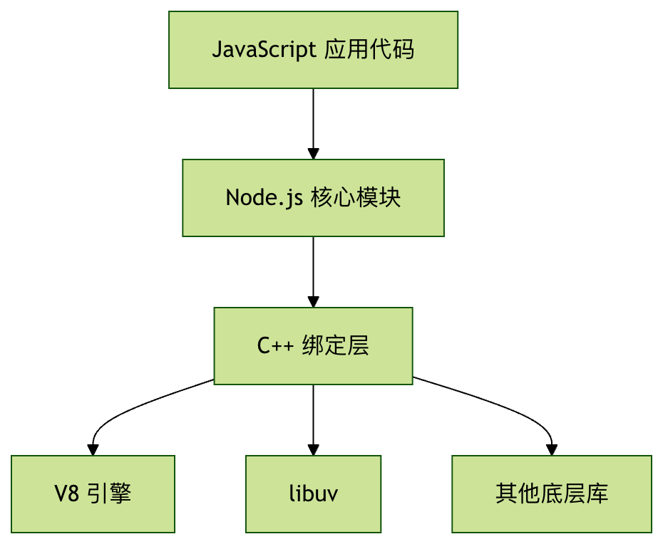

# Node.js

## 1. Node.js 基础概念

Node.js 是一个基于 Chrome V8 JavaScript 引擎构建的 JavaScript 运行时环境。简单来说，Node.js 让 JavaScript 可以在服务器端运行，而不仅仅局限于浏览器中。

### Node.js 的核心特点

- **单线程事件循环**  
  Node.js 使用单线程的事件循环模型，通过事件驱动和回调函数处理并发请求，避免了传统多线程编程中的线程切换开销。

- **非阻塞 I/O**  
  所有 I/O 操作（文件读写、网络请求等）都是异步的，当等待 I/O 操作完成时，程序不会被阻塞，可以继续处理其他任务，大大提高了应用程序的吞吐量。

- **跨平台**  
  支持 Windows、macOS、Linux 等多种操作系统，一次编写，到处运行。

- **丰富的生态系统**  
  npm（Node Package Manager）拥有数百万个开源包，活跃的开发者社区。

## 2. Node.js 的架构组成

Node.js 的架构可以分为以下几个主要层次：

### 1. JavaScript 层

这是开发者直接接触的层面，包括：

- 核心模块（如 fs、http、path 等）
- 第三方模块（通过 npm 安装）
- 用户自定义模块

### 2. C++ 绑定层

这一层将底层功能暴露给 JavaScript 层，包括：

- Node.js 核心 API 的 C++ 实现
- V8 引擎的接口封装

### 3. 底层依赖

- V8 引擎：Google 开发的 JavaScript 引擎
- libuv：跨平台的异步 I/O 库
- c-ares：异步 DNS 解析库
- OpenSSL：加密功能支持
- zlib：压缩功能支持


## 3. 事件循环机制

Node.js 的核心工作机制是事件循环，它负责调度和执行所有异步操作。

### 事件循环的阶段

- timers：执行 setTimeout 和 setInterval 的回调
- pending callbacks：执行系统操作的回调（如 TCP 错误）
- idle, prepare：内部使用
- poll：检索新的 I/O 事件，执行相关回调
- check：执行 setImmediate 的回调
- close callbacks：执行关闭事件的回调（如 socket.on('close')）

```javascript
// 示例：理解事件循环顺序
setTimeout(() => console.log('timeout'), 0);
setImmediate(() => console.log('immediate'));
// 输出顺序可能不同，取决于事件循环的启动时间
```

## 4. 非阻塞 I/O 原理

Node.js 的 I/O 操作是非阻塞的，这是通过以下方式实现的：

### 工作流程

1. 应用发起 I/O 请求（如读取文件）
2. Node.js 将请求交给 libuv 处理
3. libuv 使用系统提供的异步接口（如 Linux 的 epoll）
4. 主线程继续执行其他任务
5. I/O 完成后，回调函数被放入事件队列
6. 事件循环在适当阶段执行回调

## 5. 单线程与多进程

虽然 Node.js 是单线程的，但它可以通过以下方式利用多核 CPU：

### 1. 子进程 (child_process)

```javascript
const { fork } = require('child_process');
const child = fork('child.js');
 
child.on('message', (msg) => {
  console.log('来自子进程的消息:', msg);
});
 
child.send({ hello: 'world' });
```

### 2. 集群模式 (cluster)

```javascript
const cluster = require('cluster');
const http = require('http');
const numCPUs = require('os').cpus().length;
 
if (cluster.isMaster) {
  // 主进程 fork 工作进程
  for (let i = 0; i < numCPUs; i++) {
    cluster.fork();
  }
} else {
  // 工作进程创建HTTP服务器
  http.createServer((req, res) => {
    res.writeHead(200);
    res.end('你好世界\n');
  }).listen(8000);
}
```

### 3. Worker Threads (工作线程)

```javascript
const { Worker } = require('worker_threads');
 
const worker = new Worker(`
const { parentPort } = require('worker_threads');
  parentPort.on('message', (msg) => {
    console.log('收到消息:', msg);
    parentPort.postMessage('消息已收到');
  });
`, { eval: true });
 
worker.on('message', (msg) => {
  console.log('来自工作线程的回复:', msg);
});
 
worker.postMessage('主线程消息');
```
