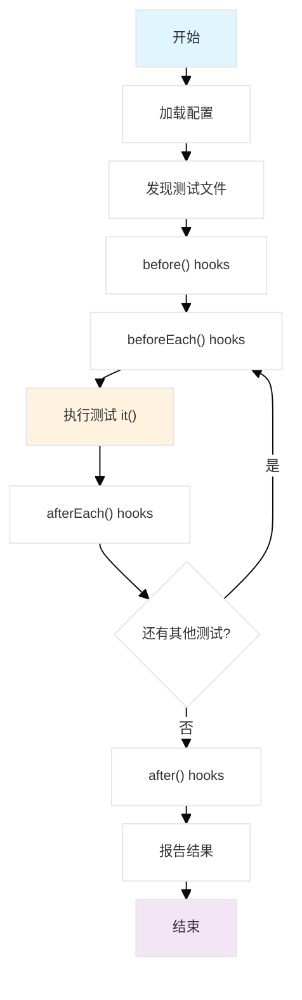

# Mocha在Node.js中的详细使用指南

## 1. 安装 (Installation)

### 系统要求

从 v11.0.0 开始，Mocha 需要 Node.js 版本：`^18.18.0 || ^20.9.0 || >=21.1.0`

### 全局安装

```bash
npm install --global mocha
```

### 作为项目开发依赖安装（推荐）

```bash
npm install --save-dev mocha
```

安装完成后，可以通过以下方式验证：

```bash
npx mocha --version
```

## 2. 入门 (Getting Started)

### 创建项目结构

```text
my-project/
├── src/
│   └── calculator.js
├── test/
│   └── test.js
├── package.json
└── .mocharc.json
```

### 编写第一个测试

首先创建一个简单的被测试模块：

```javascript
// src/calculator.js
function add(a, b) {
  return a + b;
}

function subtract(a, b) {
  return a - b;
}

module.exports = { add, subtract };
```

然后创建测试文件：

```javascript
// test/test.js
const assert = require('assert');
const { add, subtract } = require('../src/calculator');

describe('计算器功能', function () {
  describe('加法运算', function () {
    it('应该返回两个数的正确和', function () {
      assert.equal(add(2, 3), 5);
      assert.equal(add(-1, 1), 0);
      assert.equal(add(0, 0), 0);
    });
  });

  describe('减法运算', function () {
    it('应该返回两个数的正确差', function () {
      assert.equal(subtract(5, 3), 2);
      assert.equal(subtract(1, 1), 0);
      assert.equal(subtract(0, 5), -5);
    });
  });
});
```

### 配置package.json

```json
{
  "name": "my-project",
  "version": "1.0.0",
  "scripts": {
    "test": "mocha",
    "test:watch": "mocha --watch"
  },
  "devDependencies": {
    "mocha": "^10.x.x"
  }
}
```

### 运行测试

```bash
npm test
```

输出示例：

```text
计算器功能
  加法运算
    ✓ 应该返回两个数的正确和

  减法运算
    ✓ 应该返回两个数的正确差

  2 passing (5ms)
```

## 3. 运行周期概述 (Run Cycle Overview)

### 串行模式执行流程

Mocha 的执行流程按以下顺序进行：

1. **用户执行** `mocha` 命令
2. **加载配置文件**（如果存在）
3. **处理命令行选项**
4. **加载必需模块**（通过 `--require` 指定的模块）
5. **验证自定义报告器或接口**
6. **发现测试文件**（默认查找 `./test/*.{js,cjs,mjs}`）
7. **加载测试文件**：
   - 执行所有套件代码
   - 找到但不执行钩子和测试
   - 顶级钩子、测试和套件都成为"隐形"根套件的成员
8. **运行全局设置夹具**（如果有）
9. **执行测试**：
   - 执行所有"before all"钩子
   - 对每个测试执行：
     - 执行"before each"钩子
     - 执行测试并报告结果
     - 执行"after each"钩子
   - 执行所有"after all"钩子
10. **打印最终摘要**
11. **运行全局清理夹具**（如果有）

### 可视化执行流程

**流程图如下：**



## 4. 检测多个调用done()

当使用基于回调的异步测试时，如果 `done()` 被多次调用，Mocha 会抛出错误。

### 错误示例

```javascript
it('错误的双重done调用', function (done) {
  // 错误：调用done()两次
  setImmediate(done);
  setImmediate(done); // 这会引发错误
});
```

### 错误输出

```node
1) 错误的双重done调用:
   Error: done() called multiple times
```

### 正确做法

```javascript
it('正确的异步测试', function (done) {
  let callCount = 0;
  
  function callback() {
    callCount++;
    if (callCount === 2) {
      done(); // 只在所有异步操作完成后调用一次
    }
  }
  
  setImmediate(callback);
  setImmediate(callback);
});
```

## 5. 断言 (Assertions)

Mocha 允许使用任何断言库。只要抛出 `Error`，就可以工作。

### 内置 assert 模块

```javascript
const assert = require('assert');

describe('内置断言示例', function() {
  it('应该使用 assert.equal', function() {
    assert.equal(2 + 2, 4);
  });

  it('应该使用 assert.strictEqual', function() {
    assert.strictEqual(typeof 'hello', 'string');
  });

  it('应该使用 assert.deepEqual', function() {
    assert.deepEqual([1, 2, 3], [1, 2, 3]);
  });

  it('应该测试异常', function() {
    assert.throws(() => {
      throw new Error('测试错误');
    }, /测试错误/);
  });
});
```

### Chai 断言库

```javascript
const { expect } = require('chai');

describe('Chai expect 断言', function() {
  it('应该使用链式断言', function() {
    expect(2 + 2).to.equal(4);
    expect('hello').to.be.a('string').and.have.lengthOf(5);
    expect([1, 2, 3]).to.include(2);
    expect({ name: 'John', age: 30 }).to.have.property('name', 'John');
  });

  it('应该测试异步结果', function() {
    return expect(Promise.resolve(42)).to.eventually.equal(42);
  });
});
```

### Should.js 断言库

```javascript
require('should');

describe('Should.js 断言', function() {
  it('应该使用 should 语法', function() {
    (2 + 2).should.equal(4);
    'hello'.should.be.a.String().and.have.length(5);
    [1, 2, 3].should.containEql(2);
  });
});
```

## 6. 异步代码 (Asynchronous Code)

### 使用 done 回调

```javascript
describe('用户服务', function() {
  describe('#save()', function() {
    it('应该无错误保存', function(done) {
      const user = new User('Luna');
      user.save(function(err) {
        if (err) done(err);
        else done();
      });
    });

    // 或者直接传递done回调
    it('应该无错误保存（简化版）', function(done) {
      const user = new User('Luna');
      user.save(done);
    });
  });
});
```

### 使用 Promise

```javascript
describe('数据库操作', function() {
  beforeEach(function() {
    return db.clear().then(function() {
      return db.save([tobi, loki, jane]);
    });
  });

  describe('#find()', function() {
    it('应该响应匹配的记录', function() {
      return db.find({type: 'User'}).then(function(users) {
        users.should.have.length(3);
      });
    });
  });
});
```

### 使用 async/await

```javascript
describe('现代异步测试', function() {
  beforeEach(async function() {
    await db.clear();
    await db.save([tobi, loki, jane]);
  });

  describe('#find()', function() {
    it('应该响应匹配的记录', async function() {
      const users = await db.find({type: 'User'});
      users.should.have.length(3);
    });
  });
});
```

### 错误处理最佳实践

```javascript
describe('异步错误处理', function() {
  it('应该正确捕获 Promise 拒绝', function() {
    return db.find({invalid: 'query'})
      .then(() => {
        throw new Error('应该抛出错误');
      })
      .catch(err => {
        expect(err.message).to.contain('无效查询');
      });
  });

  it('应该使用 async/await 处理错误', async function() {
    try {
      await db.find({invalid: 'query'});
      throw new Error('应该抛出错误');
    } catch (err) {
      expect(err.message).to.contain('无效查询');
    }
  });
});
```

## 7. 同步代码 (Synchronous Code)

当测试同步代码时，省略回调，Mocha 会自动继续到下一个测试。

```javascript
describe('数组方法', function() {
  describe('#indexOf()', function() {
    it('应该在值不存在时返回-1', function() {
      [1, 2, 3].indexOf(5).should.equal(-1);
      [1, 2, 3].indexOf(0).should.equal(-1);
    });

    it('应该在值存在时返回正确索引', function() {
      [1, 2, 3].indexOf(1).should.equal(0);
      [1, 2, 3].indexOf(3).should.equal(2);
    });
  });

  describe('#push()', function() {
    it('应该增加数组长度', function() {
      const arr = [1, 2, 3];
      const length = arr.push(4);
      length.should.equal(4);
      arr.should.have.length(4);
    });
  });
});
```

## 8. 箭头函数 (Arrow Functions)

**重要警告**：不推荐将箭头函数传递给 Mocha。箭头函数在词法上绑定 `this`，无法访问 Mocha 上下文。

### 错误示例

```javascript
describe('我的套件', () => {
  it('我的测试', () => {
    // 这会失败！无法设置超时
    this.timeout(1000);
    assert.ok(true);
  });
});
```

### 正确做法 - 使用普通函数

```javascript
describe('我的套件', function() {
  it('我的测试', function() {
    this.timeout(1000); // 正确！
    assert.ok(true);
  });
});
```

### 如果必须使用箭头函数

```javascript
describe('我的套件', () => {
  beforeEach(() => {
    // 可以使用链式调用设置超时
  }).timeout(1000);

  it('我的测试', () => {
    assert.ok(true);
  }).timeout(1000);
}).timeout(1000);
```

## 9. 钩子 (Hooks)

钩子用于设置先决条件和清理测试后的状态。

### 基本钩子类型

```javascript
describe('钩子示例', function() {
  before(function() {
    // 在这个块中的所有测试之前运行一次
    console.log('设置测试环境');
  });

  after(function() {
    // 在这个块中的所有测试之后运行一次
    console.log('清理测试环境');
  });

  beforeEach(function() {
    // 在这个块中的每个测试之前运行
    console.log('准备单个测试');
  });

  afterEach(function() {
    // 在这个块中的每个测试之后运行
    console.log('清理单个测试');
  });

  // 测试用例
  it('测试1', function() {
    assert.ok(true);
  });

  it('测试2', function() {
    assert.ok(true);
  });
});
```

### 钩子描述

```javascript
describe('钩子描述示例', function() {
  beforeEach(function() {
    // beforeEach hook
  });

  beforeEach(function namedFun() {
    // beforeEach:namedFun
  });

  beforeEach('一些描述', function() {
    // beforeEach:一些描述
  });
});
```

### 异步钩子

```javascript
describe('异步钩子示例', function() {
  let db;

  before(async function() {
    // 异步设置
    db = await connectToDatabase();
  });

  beforeEach(function(done) {
    // 使用回调的异步钩子
    db.clear(function(err) {
      if (err) return done(err);
      db.save([user1, user2, user3], done);
    });
  });

  afterEach(async function() {
    // 清理每个测试的数据
    await db.clear();
  });

  after(function() {
    // 关闭数据库连接
    return db.close();
  });

  it('应该查找用户', function(done) {
    db.find({type: 'User'}, function(err, res) {
      if (err) return done(err);
      res.should.have.length(3);
      done();
    });
  });
});
```

## 10. 待定测试 (Pending Tests)

"待定"测试是没有回调函数的测试用例，表示"某人应该最终编写这些测试用例"。

```javascript
describe('待定测试示例', function() {
  describe('#indexOf()', function() {
    // 待定测试（没有回调函数）
    it('应该在值不存在时返回-1');
    
    it('应该在值存在时返回索引', function() {
      // 这个测试有实现
      [1, 2, 3].indexOf(2).should.equal(1);
    });
  });
});
```

### 运行时跳过测试

```javascript
describe('条件跳过测试', function() {
  it('应该只在正确环境中测试', function() {
    if (process.env.NODE_ENV !== 'test') {
      this.skip(); // 运行时跳过
    }
    // 进行断言
    assert.ok(true);
  });

  it('应该测试特定功能', function() {
    const isFeatureEnabled = checkFeature();
    if (!isFeatureEnabled) {
      this.skip();
      return; // 最佳实践：跳过后立即返回
    }
    // 测试代码
  });
});
```

## 11. 独家测试 (Exclusive Tests)

**警告**：独家测试与并行模式不兼容。

使用 `.only()` 可以只运行指定的套件或测试用例。

### 独家套件

```javascript
describe('数组操作', function() {
  describe.only('#indexOf()', function() {
    // 只有这个套件会运行
    it('应该返回-1', function() {
      [1, 2, 3].indexOf(4).should.equal(-1);
    });
  });

  describe('#push()', function() {
    // 这个套件不会运行
    it('应该增加长度', function() {
      // ...
    });
  });
});
```

### 独家测试

```javascript
describe('数组操作', function() {
  describe('#indexOf()', function() {
    it.only('应该返回-1除非存在', function() {
      // 只有这个测试会运行
      [1, 2, 3].indexOf(4).should.equal(-1);
    });

    it('应该在存在时返回索引', function() {
      // 这个测试不会运行
      [1, 2, 3].indexOf(1).should.equal(0);
    });
  });
});
```

### 多个独家测试

```javascript
describe('数组操作', function() {
  describe('#indexOf()', function() {
    it.only('测试1', function() {
      // 这个测试会运行
    });

    it.only('测试2', function() {
      // 这个测试也会运行
    });

    it('测试3', function() {
      // 这个测试不会运行
    });
  });
});
```

**注意**：不要将 `.only()` 提交到版本控制中！可以使用 `--forbid-only` 选项来防止这种情况。

## 12. 包容性测试 (Inclusive Tests)

使用 `.skip()` 可以跳过测试用例。

### 跳过单个测试

```javascript
describe('数组操作', function() {
  describe('#indexOf()', function() {
    it.skip('应该返回-1除非存在', function() {
      // 这个测试不会运行
    });

    it('应该在存在时返回索引', function() {
      // 这个测试会运行
      [1, 2, 3].indexOf(1).should.equal(0);
    });
  });
});
```

### 跳过整个套件

```javascript
describe('数组操作', function() {
  describe.skip('#indexOf()', function() {
    // 这整个套件都会被跳过
    it('测试1', function() {
      // 不会运行
    });

    it('测试2', function() {
      // 不会运行
    });
  });
});
```

### 条件跳过

```javascript
describe('环境相关测试', function() {
  before(function() {
    if (!process.env.DATABASE_URL) {
      this.skip(); // 跳过整个套件
    }
  });

  it('应该连接数据库', function() {
    // 只在有DATABASE_URL时运行
  });
});
```

## 13. 重试测试 (Retry Tests)

重试功能适用于端到端测试，不推荐用于单元测试。

```javascript
describe('重试示例', function() {
  // 在整个套件中重试失败的测试最多4次
  this.retries(4);

  beforeEach(function() {
    browser.get('http://www.example.com');
  });

  it('应该在第3次尝试时成功', function() {
    // 指定这个测试只重试最多2次
    this.retries(2);
    expect($('.loading').isDisplayed()).to.eventually.be.false;
  });

  it('应该加载页面', function() {
    // 使用套件级别的重试设置（4次）
    expect($('.content').isDisplayed()).to.eventually.be.true;
  });
});
```

**注意**：

- 重试会重新运行失败的测试和相应的 `beforeEach/afterEach` 钩子
- 不会重新运行 `before/after` 钩子
- `this.retries()` 对失败的钩子无效

## 14. 动态生成测试 (Dynamically Generating Tests)

### 使用数组生成测试

```javascript
const assert = require('assert');

function add(args) {
  return args.reduce((prev, curr) => prev + curr, 0);
}

describe('add() 函数', function() {
  const tests = [
    {args: [1, 2], expected: 3},
    {args: [1, 2, 3], expected: 6},
    {args: [1, 2, 3, 4], expected: 10}
  ];

  tests.forEach(({args, expected}) => {
    it(`正确计算 ${args.length} 个参数的和`, function() {
      const res = add(args);
      assert.strictEqual(res, expected);
    });
  });
});
```

### 使用闭包生成测试

```javascript
describe('add() 函数', function() {
  const testAdd = ({args, expected}) =>
    function() {
      const res = add(args);
      assert.strictEqual(res, expected);
    };

  it('正确计算2个参数', testAdd({args: [1, 2], expected: 3}));
  it('正确计算3个参数', testAdd({args: [1, 2, 3], expected: 6}));
  it('正确计算4个参数', testAdd({args: [1, 2, 3, 4], expected: 10}));
});
```

### 异步生成测试数据

```javascript
// 使用 ES 模块和顶级 await
// testfile.mjs
import assert from 'assert';

// 顶级 await: Node >= v14.8.0 with ESM 测试文件
const tests = await new Promise(resolve => {
  setTimeout(resolve, 1000, [
    {args: [1, 2], expected: 3},
    {args: [1, 2, 3], expected: 6},
    {args: [1, 2, 3, 4], expected: 10}
  ]);
});

describe('add() 函数', function() {
  tests.forEach(({args, expected}) => {
    it(`正确计算 ${args.length} 个参数的和`, function() {
      const res = args.reduce((sum, curr) => sum + curr, 0);
      assert.strictEqual(res, expected);
    });
  });
});
```

## 15. 超时 (Timeouts)

### 套件级别超时

```javascript
describe('慢速操作', function() {
  this.timeout(5000); // 5秒超时

  it('应该在5秒内完成', function(done) {
    setTimeout(done, 3000);
  });

  it('应该继承套件超时', function(done) {
    setTimeout(done, 2500);
  });
});
```

### 测试级别超时

```javascript
describe('超时设置示例', function() {
  it('应该在500毫秒内完成', function(done) {
    this.timeout(500);
    setTimeout(done, 300);
  });

  it('禁用超时', function(done) {
    this.timeout(0); // 禁用超时
    // 这个测试可以运行任意长时间
    setTimeout(done, 1000);
  });
});
```

### 钩子级别超时

```javascript
describe('钩子超时示例', function() {
  beforeEach(function(done) {
    this.timeout(3000); // 非常长的环境设置
    setTimeout(done, 2500);
  });

  it('测试用例', function() {
    assert.ok(true);
  });
});
```

### 异步超时最佳实践

```javascript
describe('API 测试', function() {
  // 网络请求通常需要更长时间
  this.timeout(10000);

  it('应该获取用户数据', async function() {
    // 对于特别慢的操作，可以设置更长的超时
    this.timeout(15000);
    
    const response = await fetch('/api/users');
    const users = await response.json();
    expect(users).to.be.an('array');
  });
});
```

## 16. 命令行用法 (Command-Line Usage)

### 基本命令

```bash
# 运行默认测试
mocha

# 运行特定文件
mocha test/unit/*.js

# 运行特定目录
mocha test/integration/

# 递归运行测试
mocha --recursive test/
```

### 测试过滤

```bash
# 使用正则表达式过滤测试
mocha --grep "用户"

# 使用字符串匹配
mocha --fgrep "API"

# 反向匹配（排除）
mocha --grep "慢速测试" --invert

# 组合过滤
mocha --grep "用户|管理员"
```

### 配置选项

```bash
# 设置超时
mocha --timeout 5000

# 设置慢速测试阈值
mocha --slow 1000

# 启用监视模式
mocha --watch

# 选择报告器
mocha --reporter json

# 并行运行
mocha --parallel --jobs 4

# 在第一个失败后停止
mocha --bail

# 检查全局变量泄漏
mocha --check-leaks
```

### 文件选项

```bash
# 指定文件扩展名
mocha --extension ts

# 预先加载文件
mocha --require babel-register

# 忽略文件
mocha --ignore "test/fixtures/**"

# 排序测试文件
mocha --sort
```

### 调试选项

```bash
# 启用调试器
mocha --inspect

# 显示完整堆栈跟踪
mocha --full-trace

# 内联差异显示
mocha --inline-diffs

# 干运行（不执行测试）
mocha --dry-run
```

## 17. 并行测试 (Parallel Tests)

并行模式可以显著提高测试执行速度，但有一些重要限制。

### 启用并行模式

```bash
# 启用并行执行
mocha --parallel

# 指定工作进程数量
mocha --parallel --jobs 4

# 使用CPU核心数减1（默认）
mocha --parallel --jobs auto
```

### 配置文件中启用

```javascript
// .mocharc.js
module.exports = {
  parallel: true,
  jobs: 4
};
```

### 并行模式限制

#### 1. 不兼容的报告器

以下报告器在并行模式下不工作：

- `progress`
- `json-stream`

#### 2. 独家测试被禁用

```javascript
// 在并行模式下这些不起作用
describe.only('独家套件', function() {
  // 不会被执行
});

it.only('独家测试', function() {
  // 不会被执行
});
```

#### 3. 文件执行顺序不确定

```javascript
// 这些选项在并行模式下不能使用
// --sort
// --file
```

#### 4. 根钩子不是全局的

```javascript
// 在并行模式下，这种根钩子只影响当前文件
beforeEach(function() {
  // 只对当前文件的测试有效
});
```

### 并行测试最佳实践

#### 1. 确保测试独立性

```javascript
// 错误：测试间共享状态
let sharedData = {};

describe('测试A', function() {
  it('设置数据', function() {
    sharedData.value = 42;
  });
});

describe('测试B', function() {
  it('使用数据', function() {
    // 在并行模式下，这可能会失败
    expect(sharedData.value).to.equal(42);
  });
});

// 正确：每个测试独立设置
describe('测试A', function() {
  let localData;
  
  beforeEach(function() {
    localData = { value: 42 };
  });
  
  it('应该有正确的值', function() {
    expect(localData.value).to.equal(42);
  });
});
```

#### 2. 避免端口冲突

```javascript
// 为每个工作进程分配不同的端口
describe('服务器测试', function() {
  let server;
  const port = 3000 + parseInt(process.env.MOCHA_WORKER_ID || '0');
  
  before(function() {
    server = createServer().listen(port);
  });
  
  after(function() {
    return server.close();
  });
});
```

#### 3. 清理资源

```javascript
describe('数据库测试', function() {
  let connection;
  
  before(async function() {
    connection = await createConnection();
  });
  
  afterEach(async function() {
    // 清理每个测试的数据
    await connection.query('DELETE FROM test_table');
  });
  
  after(async function() {
    // 确保关闭连接
    await connection.close();
  });
});
```

### 故障排除并行模式

1. 确保使用支持的报告器
2. 移除 `.only()` 和 `.skip()` 的使用
3. 检查配置文件设置
4. 确保测试间没有共享全局状态或资源竞争  
5. 使用环境变量区分工作进程（如端口、数据库库名等）  
6. 查看 Mocha 输出的错误日志，定位问题  

---

## 18. 配置 Mocha (Node.js)

Mocha 支持多种配置方式，方便定制测试行为。

### 配置文件支持格式

- `.mocharc.json`
- `.mocharc.yaml`
- `.mocharc.yml`
- `.mocharc.js`
- `mocha.opts`（已废弃）

### 示例 `.mocharc.json`

```json
{
  "timeout": 5000,
  "recursive": true,
  "reporter": "spec",
  "parallel": true,
  "jobs": 4,
  "watch-files": ["src/**/*.js", "test/**/*.js"],
  "watch-ignore": ["node_modules"]
}
```

### 通过配置文件启动

```bash
mocha
```

Mocha 会自动加载项目根目录下的配置文件。

---

## 19. Node.js 原生 ESM 支持

从 Mocha v7+ 支持原生 ES 模块。

### 设置 `package.json`

```json
{
  "type": "module"
}
```

### 测试文件示例（`test/example.test.mjs`）

```js
import assert from 'assert';

describe('加法测试', function () {
  it('1 + 1 应该等于 2', function () {
    assert.strictEqual(1 + 1, 2);
  });
});
```

### 运行方式

```bash
mocha
```

或者

```bash
mocha test/example.test.mjs
```

> Mocha 会自动识别 ESM 文件，无需额外配置。

---

## 20. 测试目录结构示例

推荐将测试文件放在 `test/` 文件夹，测试文件命名使用 `.test.js` 或 `.spec.js`。

```text
my-project/
├── src/
│   ├── calculator.js
│   └── user.js
├── test/
│   ├── calculator.test.js
│   └── user.test.js
├── package.json
└── .mocharc.json
```

---

## 21. 示例总结

```js
const assert = require('assert');

describe('计算器模块', function() {

  before(() => {
    console.log('测试开始');
  });

  after(() => {
    console.log('测试结束');
  });

  describe('加法', function() {
    it('2 + 3 应该等于 5', function() {
      assert.strictEqual(2 + 3, 5);
    });
  });

  describe('异步示例', function() {
    it('异步回调测试', function(done) {
      setTimeout(() => {
        assert.ok(true);
        done();
      }, 100);
    });
  });

});
```

---

## 更多资源

- [Mocha 官方文档](https://mochajs.org/)
- [Chai 断言库](https://www.chaijs.com/)
- [Node.js Assert 模块](https://nodejs.org/api/assert.html)
