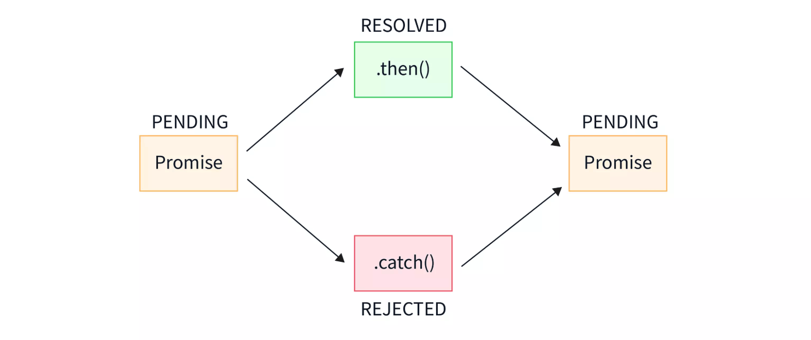

# Node.js 回调函数

## 1. 概述

回调函数是一种异步编程模式，用于处理 I/O 操作，如文件读写、数据库操作、网络请求等。

使用回调函数，Node.js 可以在 I/O 操作进行时继续执行其他代码，一旦 I/O 操作完成，再执行回调函数。Node.js 是单线程的，但通过事件驱动和回调机制实现异步操作。

**作用**：避免阻塞代码

## 2. 回调函数的实现

```javascript
// 创建 input.txt 文件，写入"Hello World"
var fs = require("fs");
 
fs.readFile('input.txt', function (err, data) {
    if (err) return console.error(err);
    console.log(data.toString());
});
 
console.log("程序执行结束!");
 
// 输出：
// 程序执行结束
// Hello World
```

**参数解释**  
`err`：错误对象，如果读取失败会有值。  
`data`：读取的文件内容。

## 3. 回调地狱问题

回调函数的嵌套会导致代码难以维护，因此需要避免。

```javascript
fs.readFile('file1.txt', 'utf8', (err, data1) => {
    if (err) {
        console.error('Error reading file1:', err);
        return;
    }
 
    fs.readFile('file2.txt', 'utf8', (err, data2) => {
        if (err) {
            console.error('Error reading file2:', err);
            return;
        }
 
        fs.readFile('file3.txt', 'utf8', (err, data3) => {
            if (err) {
                console.error('Error reading file3:', err);
                return;
            }
 
            console.log('Data from all files:', data1, data2, data3);
        });
    });
});
```

为了改善代码的可读性和可维护性，可以使用以下几种方法：

- **Promises**：允许以链式方式处理异步操作，避免回调地狱。
- **async/await**：基于 Promises，提供接近同步代码风格的异步编程方式。
- **事件驱动编程**：通过监听和触发事件处理异步操作。

## Promise

### 1. 概述

Promise 是一个表示异步操作最终完成或失败的对象。它有三种状态：

- **Pending（等待中）**：初始状态，既不是成功，也不是失败。
- **Fulfilled（已成功）**：操作成功完成。
- **Rejected（已失败）**：操作失败。

Promise 的状态一旦改变（从 pending 变为 fulfilled 或 rejected），就不会再改变。



### 2. 创建 Promise

使用 `new Promise()` 构造函数来创建一个 Promise 对象。

```javascript
const myPromise = new Promise((resolve, reject) => {
  // 异步操作
  const success = true; // 假设这是异步操作的结果
  
  if (success) {
    resolve('操作成功！'); // 状态变为 fulfilled
  } else {
    reject('操作失败！'); // 状态变为 rejected
  }
});
```

### 3. 使用 Promise

Promise 提供了 `.then()` 和 `.catch()` 方法来处理成功和失败的情况：

```javascript
myPromise
  .then((result) => {
    console.log(result); // 输出："操作成功！"
  })
  .catch((error) => {
    console.error(error); // 输出："操作失败！"
  });
```

### 4. Promise 的链式调用

```javascript
function asyncOperation1() {
  return new Promise((resolve) => {
    setTimeout(() => resolve('第一步完成'), 1000);
  });
}
 
function asyncOperation2(data) {
  return new Promise((resolve) => {
    setTimeout(() => resolve(`${data}, 第二步完成`), 1000);
  });
}
 
asyncOperation1()
  .then((result) => asyncOperation2(result))
  .then((finalResult) => {
    console.log(finalResult); // 输出："第一步完成, 第二步完成"
  })
  .catch((error) => {
    console.error('链式中出错:', error);
  });
```

### 5. Promise 的静态方法

#### Promise.all()

等待所有 Promise 完成，或任意一个 Promise 失败：

```javascript
const promise1 = Promise.resolve('第一个');
const promise2 = Promise.resolve('第二个');
 
Promise.all([promise1, promise2])
  .then((results) => {
    console.log(results); // 输出：['第一个', '第二个']
  });
```

#### Promise.race()

返回最先完成或失败的 Promise：

```javascript
const promise1 = new Promise((resolve) => setTimeout(resolve, 500, '第一个'));
const promise2 = new Promise((resolve) => setTimeout(resolve, 100, '第二个'));
 
Promise.race([promise1, promise2])
  .then((result) => {
    console.log(result); // 输出："第二个"
  });
```

## async/await

在 Node.js 中，async/await 是一种处理异步操作的语法糖。async/await 基于 Promise，但让异步代码看起来更像同步代码，极大地提高了代码的可读性和可维护性。`async` 关键字用于声明一个函数是异步的，而 `await` 关键字用于等待一个 Promise 的解决（resolve）或拒绝（reject）。使用 async/await 可以避免回调地狱（callback hell）并使错误处理更加直观。

### 1. 基本语法

#### async 函数

任何函数都可以通过添加 `async` 关键字变成异步函数：

```javascript
async function myFunction() {
  return "Hello World";
}
```

async 函数总是返回一个 Promise。如果返回值不是 Promise，它会被自动包装成 Promise。

#### await 表达式

`await` 只能在 `async` 函数内部使用，它会暂停函数的执行，等待 Promise 解决，然后继续执行并返回结果：

```javascript
async function fetchData() {
  const response = await fetch('https://api.example.com/data');
  const data = await response.json();
  return data;
}
```

### 2. 错误处理

#### try/catch 方式

处理 async/await 错误最常用的方法是使用 try/catch：

```javascript
async function getUser() {
  try {
    const response = await fetch('https://api.example.com/user');
    const user = await response.json();
    return user;
  } catch (error) {
    console.error('Error fetching user:', error);
    throw error; // 可以选择重新抛出错误
  }
}
```

#### 直接处理 Promise

你也可以直接处理返回的 Promise：

```javascript
getUser()
  .then(user => console.log(user))
  .catch(error => console.error(error));
```
