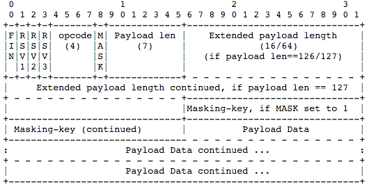
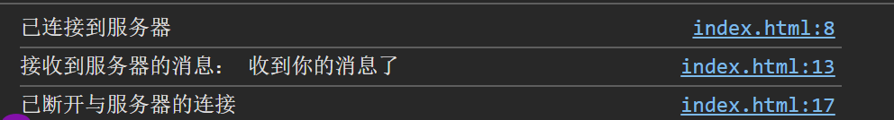

# 基于 WebSocket 通信功能的实现

## 一、WebSocket 的底层原理

WebSocket 是一种通信协议，它提供了在单个 TCP 连接上进行全双工通信的能力。WebSocket 协议在客户端和服务器之间创建了一个持久连接，这使得数据可以双向传输。它的主要优点是降低了通信延迟，提高了通信效率。下面将详细介绍 WebSocket 的底层原理。

### 1. 协议概述

WebSocket 协议被设计为一种独立的协议，但它的握手阶段借用了 HTTP 协议。WebSocket 连接的建立过程如下：

1. **握手阶段**：客户端发起一个 HTTP 请求来建立连接，这个请求包含特定的 WebSocket 字段。
2. **建立连接**：服务器收到请求并通过返回特定的响应头来接受连接。
3. **数据传输**：连接建立后，客户端和服务器可以通过这个连接互相发送数据包，直到连接关闭。

### 2. 握手阶段

#### 1. 客户端请求

客户端通过发送一个 HTTP 请求来发起 WebSocket 连接：

```http
GET /chat HTTP/1.1
Host: example.com
Upgrade: websocket
Connection: Upgrade
Sec-WebSocket-Key: dGhlIHNhbXBsZSBub25jZQ==
Sec-WebSocket-Version: 13
```

- `Upgrade` 和 `Connection` 头字段用于表示请求升级到 WebSocket 协议。
- `Sec-WebSocket-Key` 是一个 Base64 编码的值，用于安全校验。
- `Sec-WebSocket-Version` 指定 WebSocket 协议的版本。

#### 2. 服务器响应

服务器收到客户端请求并通过返回特定的响应头来接受连接：

```http
HTTP/1.1 101 Switching Protocols
Upgrade: websocket
Connection: Upgrade
Sec-WebSocket-Accept: s3pPLMBiTxaQ9kYGzzhZRbK+xOo=
```

- `101 Switching Protocols` 状态码表示协议切换。
- `Sec-WebSocket-Accept` 是根据客户端的 `Sec-WebSocket-Key` 生成的一个值，用于校验连接的合法性。

### 3. 数据传输

#### 1. 数据帧格式


一旦连接建立，数据以帧（Frame）的形式传输。WebSocket 的数据帧格式如下：

| 字段         | 位数  | 说明                                                                 |
|--------------|-------|----------------------------------------------------------------------|
| `FIN`        | 1     | 标记当前数据帧是否为最后一个数据帧（一个消息可能分多个帧传输）       |
| `RSV1-3`     | 各1位 | 扩展用途，无扩展时设为0                                              |
| `Opcode`     | 4     | 操作码：0x0：延续帧，0x1：文本帧，0x2：二进制帧，0x8：关闭连接，0x9：Ping请求，0xA：Pong响应 |
| `MASK`       | 1     | 标记数据是否使用掩码（客户端→服务器必须掩码，服务器→客户端不掩码）   |
| `Payload len`| 7/16/64 | 数据长度：≤125 字节：7位表示，126 字节：后续2字节（16位）表示，>126 字节：后续8字节（64位）表示 |
| `Masking-key`| 32    | 掩码密钥（仅当 `MASK=1` 时存在）                                    |
| `Payload data`| -    | 实际传输的数据内容                                                  |

#### 2. 数据传输过程

- **客户端发送数据**：客户端将数据封装成帧，添加掩码并发送给服务器。
- **服务器接收数据**：服务器接收数据帧，解析掩码并提取实际数据。
- **服务器发送数据**：服务器将数据封装成帧发送给客户端，通常不使用掩码。
- **客户端接收数据**：客户端接收数据帧并提取数据。

### 4. 连接关闭

WebSocket 连接可以由客户端或服务器发起关闭。关闭过程如下：

1. 一方发送一个带有关闭帧（Opcode 为 0x8）的数据帧，包含关闭状态码和可选的关闭原因。
2. 另一方收到关闭帧后，应发送一个关闭帧作为响应，然后关闭连接。

关闭帧的负载数据格式：

- **状态码**：2字节整数，表示关闭原因（如 1000 表示正常关闭）。
- **关闭原因**：可选的文本数据，解释关闭原因。

## 二、Node 实现基于 WebSocket 两个页面简单的通信

### 前置要求

- 安装 Node.js
- 新建 Node 项目
- 安装 ws 模块：

  ```bash
  npm install ws
  ```

### 1. 创建 WebSocket 服务器（server.js）

```javascript
const WebSocket = require('ws');

// 创建 WebSocket 服务器，监听 8999 端口
const wss = new WebSocket.Server({ port: 8999 });

wss.on('connection', (ws) => {
  console.log('客户端已连接');

  // 接收客户端消息
  ws.on('message', (message) => {
    const text = message.toString(); 
    console.log('接收到消息：', text);
    // 回复客户端
    ws.send('收到你的消息了');
  });

  // 连接关闭时触发
  ws.on('close', () => {
    console.log('客户端已断开连接');
  });
});

console.log('WebSocket 服务器已启动，监听端口 8999');
```

上述代码创建了一个 WebSocket 服务器，并监听 8999 端口。当有新的连接建立时，服务器会打印“客户端已连接”；收到消息时打印消息内容并回复“收到你的消息了”；连接断开时打印“客户端已断开连接”。

### 2. 创建客户端页面

```html
<!DOCTYPE html>
<html>
<body>
  <script>
    // 连接 WebSocket 服务器
    const ws = new WebSocket('ws://localhost:8999');

    // 连接建立成功时触发
    ws.onopen = () => {
      console.log('已连接到服务器');
      // 发送测试消息
      ws.send('这是一条测试消息'); 
    };

    // 收到服务器消息时触发
    ws.onmessage = (event) => {
      console.log('接收到服务器的消息：', event.data);
    };

    // 连接关闭时触发
    ws.onclose = () => {
      console.log('已断开与服务器的连接');
    };
  </script>
</body>
</html>
```

### 运行流程

1. 启动服务器：`node server.js`
2. 在浏览器中打开客户端页面（可打开多个标签页模拟多个客户端）
3. 查看浏览器控制台和服务器控制台的输出：
   - 服务器控制台显示“客户端已连接”和收到的消息
   - 客户端控制台显示“已连接到服务器”和服务器回复的消息

